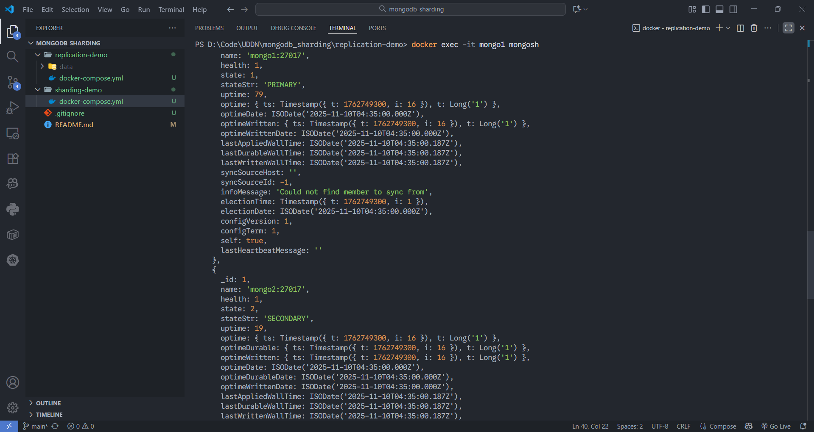
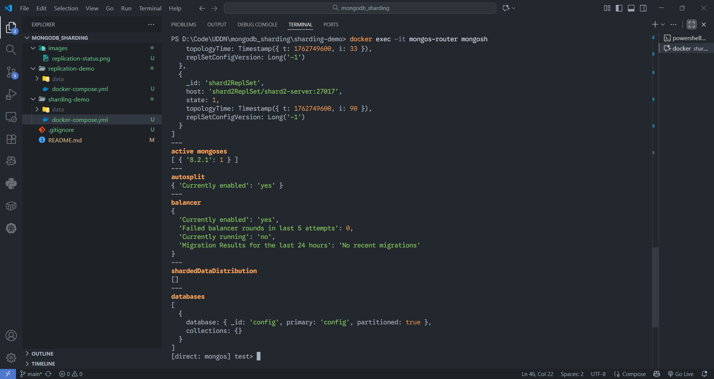

# 🚀 Mô phỏng MongoDB: Replication và Sharding

Repo này chứa 2 mô phỏng các kiến trúc cơ bản của MongoDB, sử dụng Docker và Docker Compose.

1.  **Replication (Replica Set):** Mô phỏng tính năng High Availability (Sẵn sàng cao).
2.  **Sharding (Sharded Cluster):** Mô phỏng tính năng Horizontal Scaling (Mở rộng ngang).

---

## 1. Mô phỏng Replication (Replica Set)

Mô phỏng một cụm 3 node (1 Primary, 2 Secondary) để đảm bảo an toàn dữ liệu và chịu lỗi (fault tolerance).

### ⚙️ Các bước chạy

1.  Di chuyển vào thư mục demo:
    ```bash
    cd replication-demo
    ```
2.  Khởi chạy cụm 3 node:
    ```bash
    docker-compose up -d
    ```
3.  Kết nối vào node `mongo1` để cấu hình:
    ```bash
    docker exec -it mongo1 mongosh
    ```
4.  Bên trong `mongosh`, dán lệnh sau để khởi tạo Replica Set:
    ```javascript
    rs.initiate(
      {
        _id: "rs0",
        members: [
          { _id: 0, host: "mongo1:27017" },
          { _id: 1, host: "mongo2:27017" },
          { _id: 2, host: "mongo3:27017" }
        ]
      }
    )
    ```
5.  Kiểm tra trạng thái. Thấy 1 `PRIMARY` và 2 `SECONDARY`:
    ```javascript
    rs.status()
    ```

### 📸 Kết quả minh họa



## 2. Mô phỏng Sharding (Sharded Cluster)

Mô phỏng một cụm Sharded Cluster tối giản bao gồm: 1 Config Server (RS), 2 Shard (RS), và 1 Mongos (Router).

### ⚙️ Các bước chạy

1.  Di chuyển vào thư mục demo:
    ```bash
    cd sharding-demo
    ```
2.  Khởi chạy toàn bộ các thành phần (Config, Shards, Mongos):
    ```bash
    docker-compose up -d
    ```
3.  **Khởi tạo (Initiate) các Replica Set** cho Config và 2 Shards. Chạy lần lượt 3 lệnh này ở Terminal (đợi vài giây giữa mỗi lệnh):
    ```bash
    # Init Config Server
    docker exec -it config-server mongosh --eval "rs.initiate({ _id: 'csReplSet', members: [ { _id: 0, host: 'config-server:27017' } ] })"
    
    # Init Shard 1
    docker exec -it shard1-server mongosh --eval "rs.initiate({ _id: 'shard1ReplSet', members: [ { _id: 0, host: 'shard1-server:27017' } ] })"

    # Init Shard 2
    docker exec -it shard2-server mongosh --eval "rs.initiate({ _id: 'shard2ReplSet', members: [ { _id: 0, host: 'shard2-server:27017' } ] })"
    ```
4.  Kết nối vào **Router (`mongos-router`)** để "add" 2 Shards vào cụm:
    ```bash
    docker exec -it mongos-router mongosh
    ```
5.  Bên trong `mongosh` của `mongos-router`, chạy 2 lệnh sau:
    ```javascript
    sh.addShard("shard1ReplSet/shard1-server:27017")
    sh.addShard("shard2ReplSet/shard2-server:27017")
    ```
6.  Kiểm tra trạng thái cụm. Bạn sẽ thấy 2 Shards đã được thêm vào:
    ```javascript
    sh.status()
    ```

### 📸 Kết quả minh họa


